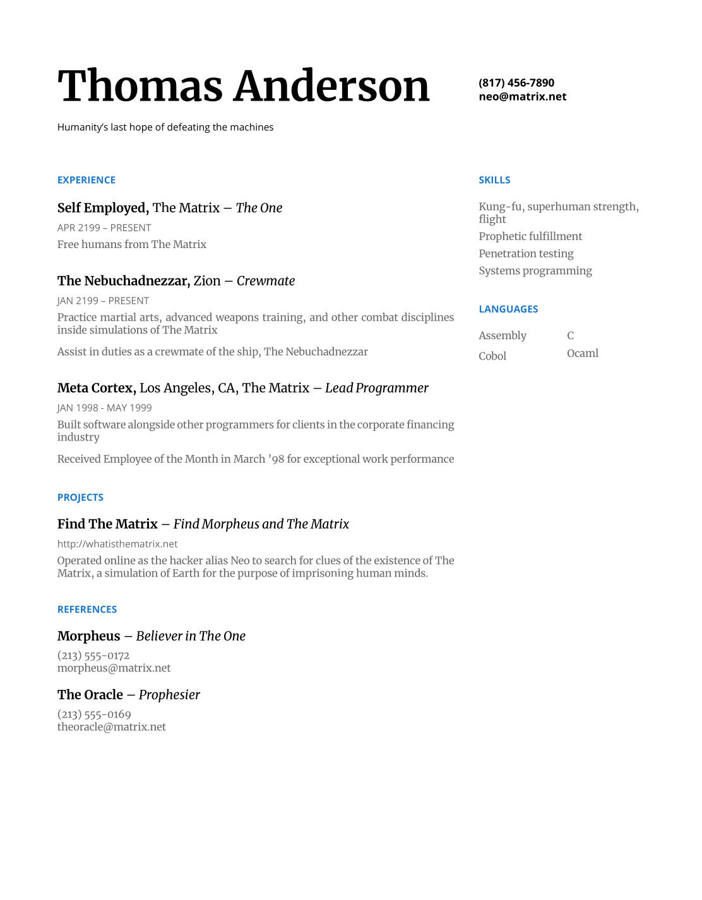

# A LaTeX Resume Template

This project is the recreation of a Google Docs resume template in LaTeX that
uses a custom document class for style and formatting so you can focus on the
resume's content.



## Getting Started

Write your own resume with this template by forking this repo and modifying the
contents of `resume.tex`.  Compile the document to PDF with your favorite LaTeX
runtime, or use the `Makefile` to compile with
[tectonic](https://tectonic-typesetting.github.io/en-US/) in a Docker
container.

```sh
git clone git@github.com:michaeljoelphillips/latex-resume-template.git
cd latex-resume-template
make
```
